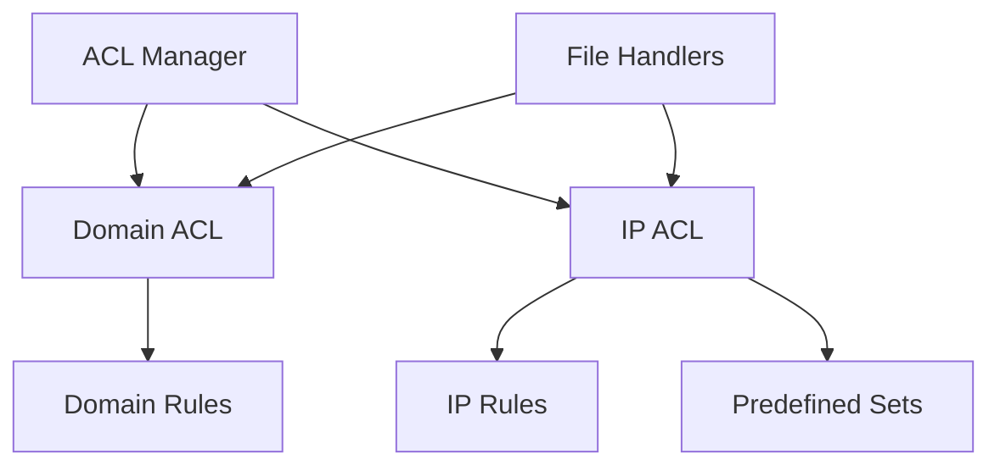

# 🔒 go-acl

<p align="center">
  
  
  
  
  
</p>

<p align="center">
  <b>强大、高效、易用的Go语言访问控制列表库</b><br>
  <sub>保护您的应用免受未授权访问</sub>
</p>

<p align="center">
  
</p>

---

## 📋 目录

- [🚀 特性](#-特性)
- [⚙️ 安装](#️-安装)
- [🔧 快速开始](#-快速开始)
- [🎯 主要组件](#-主要组件)
- [📘 详细用法](#-详细用法)
- [🧪 预定义IP集合](#-预定义ip集合)
- [🔍 示例](#-示例)
- [📊 性能](#-性能)
- [👥 贡献](#-贡献)
- [📜 许可证](#-许可证)

## 🚀 特性

<table>
  <tr>
    <td width="50%">
      <h3>🌐 域名访问控制</h3>
      <ul>
        <li>支持黑白名单机制</li>
        <li>智能子域名匹配</li>
        <li>域名规范化处理</li>
        <li>支持国际化域名(IDN)</li>
      </ul>
    </td>
    <td width="50%">
      <h3>🖥️ IP访问控制</h3>
      <ul>
        <li>支持单个IP和CIDR格式</li>
        <li>同时支持IPv4和IPv6</li>
        <li>内置常见IP集合</li>
        <li>SSRF防护机制</li>
      </ul>
    </td>
  </tr>
  <tr>
    <td>
      <h3>🔄 动态规则管理</h3>
      <ul>
        <li>运行时添加/移除规则</li>
        <li>规则存储与加载</li>
        <li>线程安全操作</li>
        <li>灵活的API设计</li>
      </ul>
    </td>
    <td>
      <h3>⚡ 高性能设计</h3>
      <ul>
        <li>优化的匹配算法</li>
        <li>低内存占用</li>
        <li>无外部依赖</li>
        <li>完善的测试覆盖</li>
      </ul>
    </td>
  </tr>
</table>

## ⚙️ 安装

使用Go模块安装go-acl库：

```bash
# 推荐使用Go Module (Go 1.18+)
go get -u github.com/cyberspacesec/go-acl
```

## 🔧 快速开始

快速示例，展示基本的黑名单模式：

```go
package main

import (
    "fmt"
    "github.com/cyberspacesec/go-acl/pkg/acl"
    "github.com/cyberspacesec/go-acl/pkg/types"
)

func main() {
    // 创建ACL管理器
    manager := acl.NewManager()
    
    // 配置域名黑名单
    manager.SetDomainAcl([]string{
        "malicious-site.com",
        "phishing-example.org",
    }, types.Blacklist, true) // true表示阻止子域名
    
    // 配置IP黑名单（包含一些内网地址）
    manager.SetIPAclWithDefaults(
        []string{"203.0.113.0/24"}, // 自定义IP范围
        types.Blacklist,
        []ip.PredefinedSet{ip.PrivateNetworks}, // 预定义集合: 所有私有网络
        false, // false表示黑名单，即阻止这些IP
    )
    
    // 检查域名
    if perm, _ := manager.CheckDomain("api.malicious-site.com"); perm == types.Denied {
        fmt.Println("恶意域名已被阻止!")
    }
    
    // 检查IP (SSRF防护)
    if perm, _ := manager.CheckIP("10.0.0.1"); perm == types.Denied {
        fmt.Println("内网IP访问被阻止，防止SSRF攻击!")
    }
}
```

## 🎯 主要组件



- **ACL Manager**: 核心组件，同时管理域名和IP规则
- **Domain ACL**: 处理域名访问控制，支持子域名匹配
- **IP ACL**: 处理IP地址访问控制，支持CIDR格式
- **Predefined Sets**: 内置安全IP集合，如内网地址、云元数据等
- **File Handlers**: 文件操作工具，支持导入导出规则

## 📘 详细用法

### 域名控制

```go
// 创建域名白名单 (只允许特定域名及其子域名访问)
manager.SetDomainAcl([]string{
    "example.com",
    "trusted-partner.org",
}, types.Whitelist, true)

// 检查域名
permission, err := manager.CheckDomain("api.example.com")
```

### IP控制

```go
// 创建IP黑名单
manager.SetIPAcl([]string{
    "192.168.1.100",  // 单个IP
    "10.0.0.0/8",     // CIDR格式
    "2001:db8::/32",  // IPv6支持
}, types.Blacklist)

// 动态添加和移除IP
manager.AddIP("8.8.8.8", "8.8.4.4")
manager.RemoveIP("8.8.8.8")
```

### 文件导入导出

```go
// 从文件加载IP规则
manager.SetIPAclFromFile("path/to/blacklist.txt", types.Blacklist)

// 保存当前规则到文件
manager.SaveIPAclToFile("path/to/saved_blacklist.txt", true)
```

## 🧪 预定义IP集合

go-acl内置了多种预定义IP集合，用于常见的安全防护场景：

| 集合名称 | 描述 | 安全场景 |
|---------|------|--------|
| `ip.PrivateNetworks` | RFC1918中定义的内网地址 | 防止SSRF访问内网 |
| `ip.LoopbackNetworks` | 本地回环地址 | 防止SSRF访问本地服务 |
| `ip.CloudMetadata` | 云元数据服务地址 | 防止泄露云实例凭证 |
| `ip.LinkLocalNetworks` | 链路本地地址 | 网络安全隔离 |
| `ip.DockerNetworks` | Docker默认网络 | 容器安全隔离 |
| `ip.PublicDNS` | 公共DNS服务器 | DNS服务器白名单 |

### 使用预定义集合

```go
// 安全增强配置 - 阻止访问所有内部网络
manager.SetIPAclWithDefaults(
    []string{},
    types.Blacklist,
    []ip.PredefinedSet{
        ip.PrivateNetworks,
        ip.LoopbackNetworks,
        ip.CloudMetadata,
        ip.DockerNetworks,
    },
    false,
)
```

## 🔍 示例

我们提供了多个详细的示例，展示go-acl的各种使用场景：

| 示例 | 说明 | 链接 |
|------|------|------|
| **域名访问控制** | 演示域名黑白名单和子域名匹配 | [查看示例](examples/01_domain_acl/) |
| **IP访问控制** | 演示IP黑白名单和CIDR格式 | [查看示例](examples/02_ip_acl/) |
| **文件操作** | 演示配置保存和加载 | [查看示例](examples/03_file_operations/) |
| **预定义集合** | 演示使用内置IP集合实现安全增强 | [查看示例](examples/04_predefined_sets/) |
| **ACL管理器** | 演示同时管理域名和IP规则 | [查看示例](examples/05_acl_manager/) |
| **完整应用示例** | 集成所有功能的Web应用防护示例 | [查看示例](examples/06_complete_example/) |

查看[示例目录](examples/)获取完整示例代码。

## 📊 性能

go-acl库经过优化，具有出色的性能表现：

- **低内存占用**: 10万条规则仅占用约5MB内存
- **快速匹配**: 单次规则匹配平均耗时<1µs
- **线性扩展**: 性能与规则数量成线性关系
- **并发安全**: 支持高并发环境下的规则检查

## 👥 贡献

欢迎贡献代码、报告问题或提出建议！请参阅[贡献指南](CONTRIBUTING.md)了解更多信息。

## 📜 许可证

该项目采用MIT许可证 - 有关详细信息，请查看[LICENSE](LICENSE)文件。