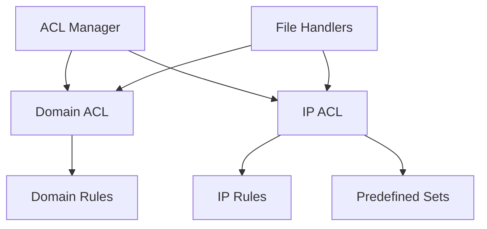

# 🔒 go-acl

<p align="center">
  
  
  
  
  
</p>

<p align="center">
  <b>强大、高效、易用的Go语言访问控制列表库</b><br>
  <sub>保护您的应用免受未授权访问</sub>
</p>

<p align="center">
  
</p>

---

## 📋 目录

- [🚀 特性](#-特性)
- [⚙️ 安装](#️-安装)
- [🔧 快速开始](#-快速开始)
- [🎯 主要组件](#-主要组件)
- [📘 详细用法](#-详细用法)
- [🧪 预定义IP集合](#-预定义ip集合)
- [🌐 预定义域名集合](#-预定义域名集合)
- [🔍 示例](#-示例)
- [🧩 可扩展性](#-可扩展性)
- [📊 性能](#-性能)
- [👥 贡献](#-贡献)
- [📜 许可证](#-许可证)

## 🚀 特性

<table>
  <tr>
    <td width="50%">
      <h3>🌐 域名访问控制</h3>
      <ul>
        <li>支持黑白名单机制</li>
        <li>智能子域名匹配</li>
        <li>域名规范化处理</li>
        <li>支持国际化域名(IDN)</li>
      </ul>
    </td>
    <td width="50%">
      <h3>🖥️ IP访问控制</h3>
      <ul>
        <li>支持单个IP和CIDR格式</li>
        <li>同时支持IPv4和IPv6</li>
        <li>内置常见IP集合</li>
        <li>SSRF防护机制</li>
      </ul>
    </td>
  </tr>
  <tr>
    <td>
      <h3>🔄 动态规则管理</h3>
      <ul>
        <li>运行时添加/移除规则</li>
        <li>规则存储与加载</li>
        <li>线程安全操作</li>
        <li>灵活的API设计</li>
      </ul>
    </td>
    <td>
      <h3>⚡ 高性能设计</h3>
      <ul>
        <li>优化的匹配算法</li>
        <li>低内存占用</li>
        <li>无外部依赖</li>
        <li>完善的测试覆盖</li>
      </ul>
    </td>
  </tr>
</table>

## ⚙️ 安装

使用Go模块安装go-acl库：

```bash
# 推荐使用Go Module (Go 1.18+)
go get -u github.com/cyberspacesec/acl-skills
```

## 🔧 快速开始

快速示例，展示基本的黑名单模式：

```go
package main

import (
    "fmt"
    "github.com/cyberspacesec/acl-skills/pkg/acl"
    "github.com/cyberspacesec/acl-skills/pkg/ip"
    "github.com/cyberspacesec/acl-skills/pkg/types"
)

func main() {
    // 创建ACL管理器
    manager := acl.NewManager()
    
    // 配置域名黑名单
    manager.SetDomainACL([]string{
        "malicious-site.com",
        "phishing-example.org",
    }, types.Blacklist, true) // true表示阻止子域名

    // 配置IP黑名单（包含一些内网地址）
    manager.SetIPACLWithDefaults(
        []string{"203.0.113.0/24"}, // 自定义IP范围
        types.Blacklist,
        []ip.PredefinedSet{ip.PrivateNetworks}, // 预定义集合: 所有私有网络
        false, // false表示黑名单，即阻止这些IP
    )
    
    // 检查域名
    if perm, _ := manager.CheckDomain("api.malicious-site.com"); perm == types.Denied {
        fmt.Println("恶意域名已被阻止!")
    }
    
    // 检查IP (SSRF防护)
    if perm, _ := manager.CheckIP("10.0.0.1"); perm == types.Denied {
        fmt.Println("内网IP访问被阻止，防止SSRF攻击!")
    }
}
```

## 📦 统一配置（JSON Policy）

除命令式 API 外，可用一份 JSON 同时配置域名 + IP 规则：

```go
pol, err := config.LoadPolicyFromFile("./security_policy.json")
if err != nil { return err }
manager := acl.NewManager()
if err := manager.ApplyPolicy(pol); err != nil { return err }
```

策略字段：`domain.{domains,listType,includeSubdomains,predefinedSets,allowPredefined,file}` 与 `ip.{ranges,listType,predefinedSets,allowPredefined,file}`。任一顶层字段省略即跳过该类型 ACL，`predefinedSets` 引用预定义集合名（见下文 [预定义域名集合](#-预定义域名集合) 与 [预定义IP集合](#-预定义ip集合)）。详见 [`testdata/security_policy.json`](testdata/security_policy.json)。

## 🌐 HTTP 中间件

把 `Manager` 的 IP/域名检查封装为 `net/http` 中间件，一行接入：

```go
handler := middleware.New(manager, middleware.Options{
    CheckClientIP: true,
    CheckHost:     true,
})(mux)
http.ListenAndServe(":8080", handler)
```

- 默认 **不信任** `X-Forwarded-For`/`X-Real-IP`（`TrustProxy=false`），防止伪造头绕过 IP 黑名单；部署在可信反代后端时再开启。
- 任一检查 `Denied` → 返回 403；未配置对应 ACL kind → 该项放行。
- 可通过 `Options.Denied` 自定义拒绝响应。

## 🎯 主要组件


```mermaid
graph TD
    A[ACL Manager] --> B[Domain ACL]
    A --> C[IP ACL]
    B --> D[Domain Rules]
    C --> E[IP Rules]
    C --> F[Predefined Sets]
    G[File Handlers] --> C
    G --> B
```

- **ACL Manager**: 核心组件，同时管理域名和IP规则
- **Domain ACL**: 处理域名访问控制，支持子域名匹配
- **IP ACL**: 处理IP地址访问控制，支持CIDR格式
- **Predefined Sets**: 内置安全IP集合，如内网地址、云元数据等
- **File Handlers**: 文件操作工具，支持导入导出规则

## 📘 详细用法

### 域名控制

```go
// 创建域名白名单 (只允许特定域名及其子域名访问)
manager.SetDomainACL([]string{
    "example.com",
    "trusted-partner.org",
}, types.Whitelist, true)

// 检查域名
permission, err := manager.CheckDomain("api.example.com")

// 通配符规则 *.example.com 仅匹配子域，不含主域本身（适合"放行主站、阻止子域"场景）
manager.SetDomainACL([]string{"*.evil.com"}, types.Blacklist, false)
// evil.com 放行，phishing.evil.com 阻止

// 前缀 api.* 匹配以 api. 开头的域名（不含主域）
// 宽松后缀 *example.com 匹配 example.com 主域及其任意子域（标签边界，区别于 *.example.com 仅子域、且不误伤 notexample.com）
// 正则 /pattern/ 按声明顺序匹配（基于 RE2 无回溯，防 ReDoS）；注意 Check 会先将域名小写化，故正则匹配小写域名
manager.SetDomainACL([]string{"api.*", "*evil.com", `/^internal-\d+\.corp$/`}, types.Blacklist, false)
// api.example.com 阻止，evil.com 阻止，notevil.com 放行，internal-7.corp 阻止
```

### IP控制

```go
// 创建IP黑名单
manager.SetIPACL([]string{
    "192.168.1.100",  // 单个IP
    "10.0.0.0/8",     // CIDR格式
    "2001:db8::/32",  // IPv6支持
}, types.Blacklist)

// 动态添加和移除IP
manager.AddIP("8.8.8.8", "8.8.4.4")
manager.RemoveIP("8.8.8.8")

// IPv6 子网与 IPv4 混合；zone id 自动剥离
manager.SetIPACL([]string{"10.0.0.0/8", "2001:db8::/32"}, types.Blacklist)
// 反查 IP 所属最长前缀 CIDR
cidr, _ := manager.LookupIP("10.1.2.3") // "10.1.0.0/16"

// IP 区间 start-end 覆盖闭区间，自动按字节边界合并为最少 CIDR（支持 IPv4/IPv6）
manager.SetIPACL([]string{"192.168.1.10-192.168.1.20", "2001:db8::1-2001:db8::5"}, types.Blacklist)
// 192.168.1.15 阻止，192.168.1.25 放行，2001:db8::3 阻止
```

### 文件导入导出

```go
// 从文件加载IP规则
manager.SetIPACLFromFile("path/to/blacklist.txt", types.Blacklist)

// 保存当前规则到文件
manager.SaveIPACLToFile("path/to/saved_blacklist.txt", true)
```

## 🧪 预定义IP集合

go-acl内置了多种预定义IP集合，用于常见的安全防护场景：

| 集合名称 | 描述 | 安全场景 |
|---------|------|--------|
| `ip.PrivateNetworks` | RFC1918中定义的内网地址 | 防止SSRF访问内网 |
| `ip.LoopbackNetworks` | 本地回环地址 | 防止SSRF访问本地服务 |
| `ip.CloudMetadata` | 云元数据服务地址 | 防止泄露云实例凭证 |
| `ip.LinkLocalNetworks` | 链路本地地址 | 网络安全隔离 |
| `ip.DockerNetworks` | Docker默认网络 | 容器安全隔离 |
| `ip.PublicDNS` | 公共DNS服务器 | DNS服务器白名单 |

### 使用预定义集合

```go
// 安全增强配置 - 阻止访问所有内部网络
manager.SetIPACLWithDefaults(
    []string{},
    types.Blacklist,
    []ip.PredefinedSet{
        ip.PrivateNetworks,
        ip.LoopbackNetworks,
        ip.CloudMetadata,
        ip.DockerNetworks,
    },
    false,
)
```

## 🌐 预定义域名集合

与 IP 侧对称，`pkg/domain` 内置多种预定义域名集合，用于常见外联管控场景：

| 集合名称 | 描述 | 安全场景 |
|---------|------|--------|
| `domain.Shorteners` | URL 短链服务域名 | 反钓鱼/隐藏跳转目标 |
| `domain.PublicFileSharing` | 公共网盘/文件分享域名 | 防止数据外泄 |
| `domain.CodeHosting` | 代码托管平台域名 | 防止源码外泄 |
| `domain.SocialMedia` | 主流社交媒体域名 | 限制企业外联访问 |
| `domain.WebmailProviders` | 网页邮箱服务域名 | 数据外泄/钓鱼管控 |
| `domain.TorExitNodes` | Tor 出口节点相关域名 | 阻断匿名网络流量 |
| `domain.DisposableEmail` | 一次性邮箱服务域名 | 阻止注册绕过验证 |
| `domain.TrustedCDN` | 可信公共 CDN 域名 | 白名单放行加速域名 |
| `domain.AllMaliciousDomains` | 上述高风险集合的合集 | 最全面外联管控 |

### 使用预定义域名集合

```go
// 黑名单：一键阻止短链 + 一次性邮箱 + 自定义恶意域名
manager.SetDomainACLWithDefaults(
    []string{"custom-malware.com"},
    types.Blacklist,
    true, // 包含子域名
    []domain.PredefinedSet{
        domain.Shorteners,
        domain.DisposableEmail,
    },
    false, // 黑名单 + false = 阻止这些集合
)

// 白名单：向已有白名单追加可信 CDN
manager.SetDomainACL([]string{"trusted-service.com"}, types.Whitelist, true)
manager.AddPredefinedDomainSet(domain.TrustedCDN, true) // 白名单 + true = 允许这些集合
```

也可在 JSON Policy 中引用（字段名与常量值一致，如 `"shorteners"`、`"disposable_email"`）：

```json
{
  "domain": {
    "domains": ["custom-malware.com"],
    "listType": "blacklist",
    "includeSubdomains": true,
    "predefinedSets": ["shorteners", "disposable_email"],
    "allowPredefined": false
  }
}
```

详见 [预定义域名集合示例](examples/09_domain_predefined_sets/)。

## 🔍 示例

我们提供了多个详细的示例，展示go-acl的各种使用场景：

| 示例 | 说明 | 链接 |
|------|------|------|
| **域名访问控制** | 演示域名黑白名单和子域名匹配 | [查看示例](examples/01_domain_acl/) |
| **IP访问控制** | 演示IP黑白名单和CIDR格式 | [查看示例](examples/02_ip_acl/) |
| **文件操作** | 演示配置保存和加载 | [查看示例](examples/03_file_operations/) |
| **预定义集合** | 演示使用内置IP集合实现安全增强 | [查看示例](examples/04_predefined_sets/) |
| **ACL管理器** | 演示同时管理域名和IP规则 | [查看示例](examples/05_acl_manager/) |
| **完整应用示例** | 集成所有功能的Web应用防护示例 | [查看示例](examples/06_complete_example/) |
| **自定义ACL扩展** | 演示注册自定义 ACL 实现到 Manager | [查看示例](examples/07_custom_acl/) |
| **HTTP 中间件** | 演示一份 JSON 配置 + 一行中间件完成访问控制 | [查看示例](examples/08_http_middleware/) |
| **预定义域名集合** | 演示短链/一次性邮箱/可信 CDN 等域名集合的外联管控 | [查看示例](examples/09_domain_predefined_sets/) |
| **子域名通配 ACL** | 演示 *.domain 仅子域访问控制 | [查看示例](examples/10_subdomain_acl/) |
| **IPv6 子网与反查** | 演示 IPv6 子网匹配与最长前缀反查 | [查看示例](examples/11_ipv6_subnet_acl/) |
| **域名模式匹配** | 演示前缀/宽松后缀/正则维度 | [查看示例](examples/12_domain_pattern_acl/) |
| **IP 区间 ACL** | 演示 start-end 区间与 IPv6 区间 | [查看示例](examples/13_ip_range_acl/) |

查看[示例目录](examples/)获取完整示例代码。

## 🧩 可扩展性

go-acl 通过 `types.MutableACL` 接口提供扩展点，支持接入自定义的访问控制实现：

```go
// 自定义 ACL 只需实现 MutableACL 接口：
//   Check(value string) (Permission, error)
//   GetListType() ListType
//   Add(rules ...string) error
//   Remove(rules ...string) error
//   GetRules() []string

manager := acl.NewManager()
manager.RegisterACL("token", myTokenACL)          // 注册自定义 ACL
perm, _ := manager.CheckKind("token", "secret")   // 统一入口检查
manager.AddRule("token", "new-token")             // 统一入口增删规则
```

内置的 `KindDomain` / `KindIP` 是预定义的注册键，与旧 API（`SetDomainACL`/`CheckIP` 等）完全兼容。详见 [自定义ACL示例](examples/07_custom_acl/)。

**分层接口**：

| 接口 | 能力 |
|------|------|
| `ACL` | 仅 `Check`（最小契约，向后兼容） |
| `ListTypeACL` | + `GetListType` |
| `MutableACL` | + `Add`/`Remove`/`GetRules`（Manager 注册所需） |

## 📊 性能

go-acl 针对高并发场景做了优化，并配有完整的基准测试（`go test -bench=. -benchmem ./...`）：

| 场景 | 规模 | 延迟 | 说明 |
|------|------|------|------|
| IPACL.Check | 100 / 1000 / 10000 | ~75 ns/op | 前缀树，**与规则数无关** |
| IPACL.Check（并发） | 10000 | ~45 ns/op | RWMutex 读写分离 |
| DomainACL.Check（精确） | 100 / 1000 / 10000 | ~70 ns/op | map O(1)，与规则数无关 |
| DomainACL.Check（含子域名） | 10000 | ~76 µs/op | 后缀线性匹配 |
| Manager.CheckIP / CheckDomain | 10000 | ~70-80 ns/op | 不同 kind 互不阻塞 |

- **零内存分配**：Check 路径 0 allocs/op
- **并发安全**：底层 ACL 内置 `sync.RWMutex`，Manager 仅用轻量锁守 map；查询不同 ACL 类型互不阻塞
- **IP 匹配常数级**：IPv4/IPv6 各一棵按位前缀树（`pkg/ip/trie.go`），查询 O(32)/O(128)

CI 在每次推送时自动运行基准测试（`benchmark` job，不阻塞主流程）。

## 👥 贡献

欢迎贡献代码、报告问题或提出建议！请参阅[贡献指南](CONTRIBUTING.md)了解更多信息。

## 📜 许可证

该项目采用MIT许可证 - 有关详细信息，请查看[LICENSE](LICENSE)文件。

## 📌 版本策略

本项目遵循 [Semantic Versioning](https://semver.org/lang/zh-CN/)。

### API 稳定性

自 `v1.0.0` 起，以下 API 保证向后兼容（仅在主版本升级时可能破坏）：

- `types` 包：`ACL`、`ListTypeACL`、`MutableACL` 接口及 `ListType`、`Permission` 枚举。
- `domain.DomainACL` 与 `ip.IPACL` 的 `Check`/`Add`/`Remove`/`GetRules`/`GetListType` 方法。
- `acl.Manager` 的 `Set*`/`Check*`/`Add*`/`Remove*`/`Get*`/`LookupIP` 方法。
- `config.Policy` 结构及其 JSON 字段。
- `middleware.New` 与 `Options` 字段。

### 实验性 API

以下 API 可能在次版本中调整，使用前请评估：

- `Manager.RegisterACL` / `UnregisterACL`（自定义 ACL 注册机制，稳定后转入稳定 API）。
- `SetDomainACLStrict`（新增，行为稳定但签名观察中）。

## 📜 发布记录

详见 [CHANGELOG.md](CHANGELOG.md)。