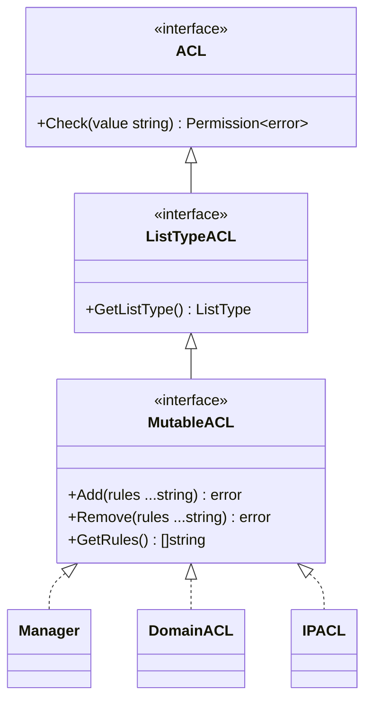

# types 包 — 抽象接口与基础类型

## 三层接口

### ACL

```go
type ACL interface {
    Check(value string) (Permission, error)
}
```

最底层的接口，仅负责判定。`Check` 接收一个字符串值（域名或 IP），返回 `Permission` 枚举。

### ListTypeACL

```go
type ListTypeACL interface {
    ACL
    GetListType() ListType
}
```

在 `ACL` 基础上暴露工作模式（黑名单或白名单）。

### MutableACL

```go
type MutableACL interface {
    ListTypeACL
    Add(rules ...string) error
    Remove(rules ...string) error
    GetRules() []string
}
```

完整的可变 ACL 接口，支持运行时增删查。Manager 通过此接口统一委托给任意已注册的子 ACL。

## 枚举

### ListType

```go
type ListType int

const (
    Blacklist ListType = iota // 默认允许，命中则拒
    Whitelist                  // 默认拒绝，命中则允
)

func (lt ListType) String() string
```

### Permission

```go
type Permission int

const (
    Denied  Permission = iota
    Allowed
)

func (p Permission) String() string
```

### 决策函数

```go
func DecideByListType(lt ListType, matched bool) Permission
```

统一决策逻辑：黑名单命中→拒绝，未命中→允许；白名单命中→允许，未命中→拒绝。

## 接口关系



## 哨兵错误

```go
var ErrNoACL = errors.New("no ACL configured")
var ErrACLAlreadyRegistered = errors.New("ACL kind already registered")
```

| 错误 | 场景 |
|------|------|
| `ErrNoACL` | Manager 中未配置对应 kind 的 ACL |
| `ErrACLAlreadyRegistered` | 注册已存在的 kind |