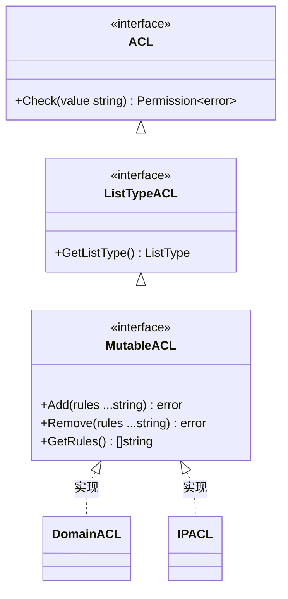
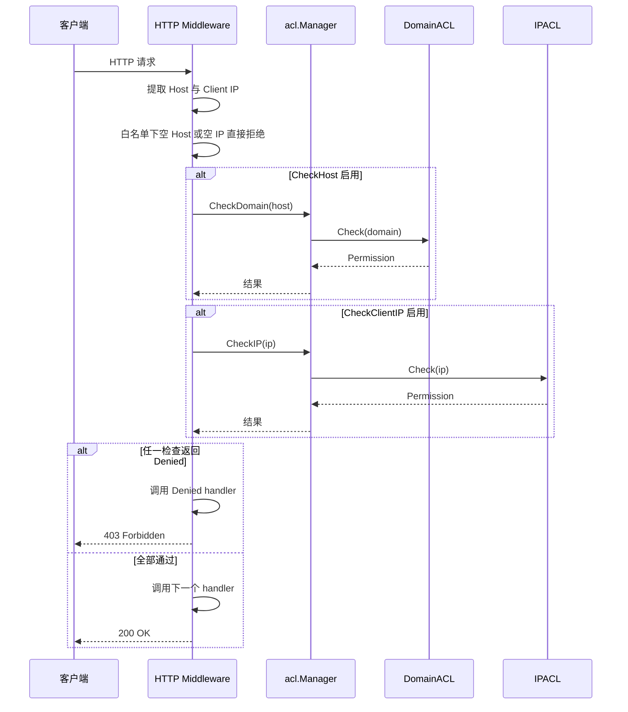
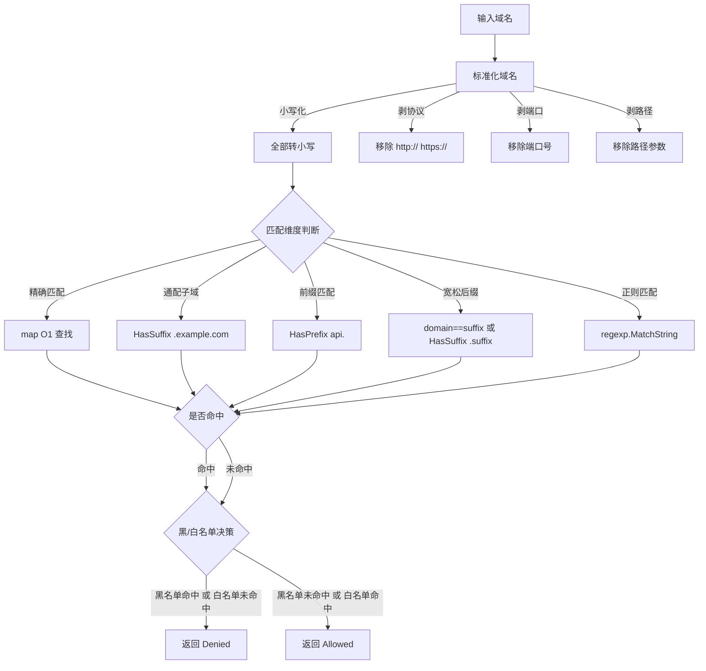
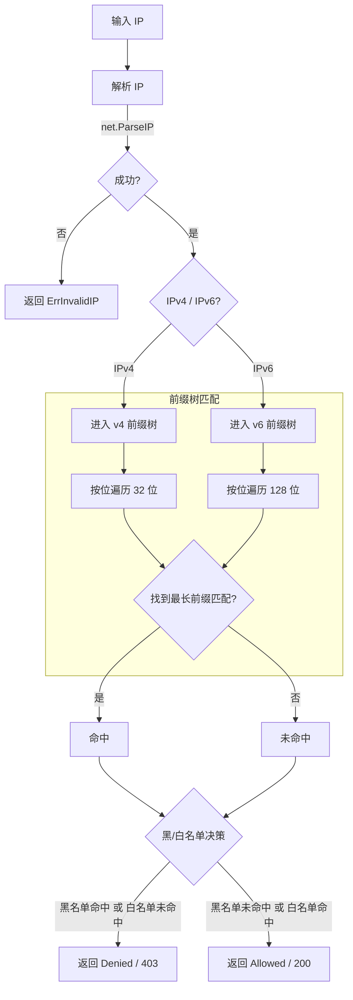
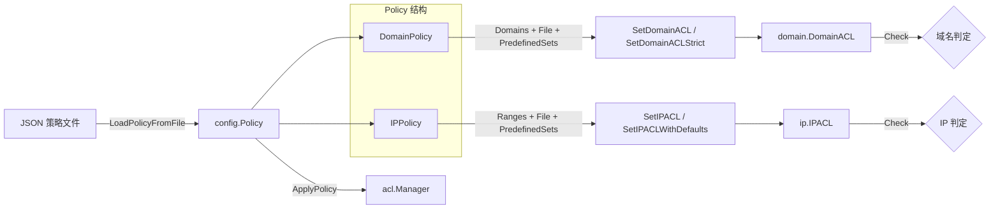
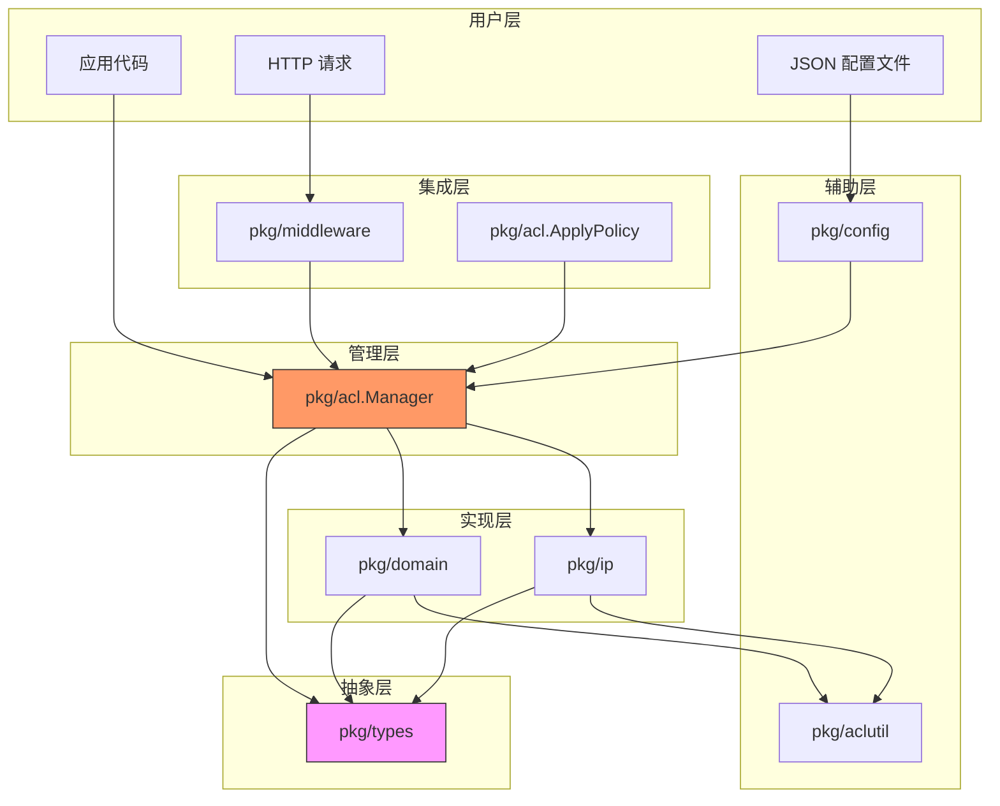

# 核心架构

## 三层接口设计

acl-skills 围绕三层接口构建，从抽象到具体逐层扩展：



| 接口 | 职责 | 方法 |
|------|------|------|
| `ACL` | 最底层，仅判定权限 | `Check(value string) (Permission, error)` |
| `ListTypeACL` | 暴露黑/白名单模式 | 继承 `ACL` + `GetListType()` |
| `MutableACL` | 支持运行时增删查 | 继承 `ListTypeACL` + `Add`/`Remove`/`GetRules` |

## Manager 统一管理

```mermaid
flowchart LR
    subgraph Manager
        direction TB
        MU[ sync.RWMutex ]
        MAP[ acls map[string]MutableACL ]
    end

    subgraph 注册的ACL
        D[domain: DomainACL]
        I[ip: IPACL]
        C[custom: 自定义ACL]
    end

    MAP -->|"kind='domain'"| D
    MAP -->|"kind='ip'"| I
    MAP -->|"kind='custom'"| C

    D -->|自带锁| DL[domain.RWMutex]
    I -->|自带锁| IL[ip.RWMutex]
    C -->|自带锁| CL[custom.RWMutex]

    style MU fill:#f96,stroke:#333
    style D fill:#6cf,stroke:#333
    style I fill:#6cf,stroke:#333
    style C fill:#6cf,stroke:#333
```

**并发安全模型：**

- `Manager.mu` 仅保护 `kind → ACL` 映射的增删查（轻量锁）
- 各子 ACL 自带 `sync.RWMutex` 保护自身规则数据
- 查询不同 kind 的 ACL 互不阻塞
- 读操作（Check）只取读锁，多个读操作可并发

## 请求处理流程



## 域名匹配流程



## IP 匹配流程



## 数据流：JSON Policy 到运行时 ACL



## 六层包依赖



## 模块职责

| 包 | 职责 | 依赖 |
|----|------|------|
| `pkg/types` | 接口定义（ACL / ListTypeACL / MutableACL）、枚举、决策函数 | 无 |
| `pkg/acl` | Manager 统一入口、ApplyPolicy、自定义 ACL 注册 | types |
| `pkg/domain` | 域名 ACL 五维匹配 | types |
| `pkg/ip` | IP ACL 前缀树匹配 | types |
| `pkg/config` | JSON Policy 解析、文件 I/O | acl |
| `pkg/middleware` | HTTP 中间件 | acl |
| `pkg/aclutil` | 辅助函数（去重追加、移除匹配） | 无 |