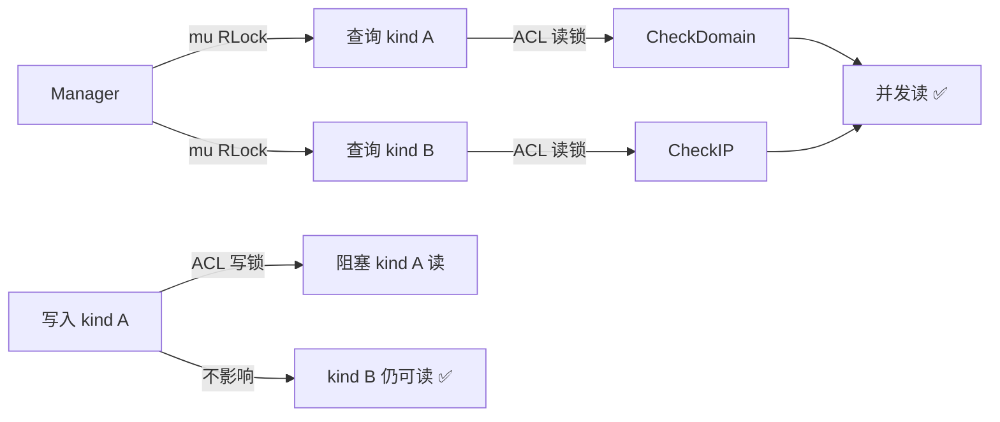

# 常见问题

## 基础问题

### 什么是 acl-skills？

acl-skills 是一个 Go 访问控制列表库，支持域名和 IP 两个维度的黑/白名单匹配。零外部依赖，并发安全，适合用于 SSRF 防护、内网保护、访问控制等场景。

### 和标准库 `net/http` 的 `http.Handler` 有什么不同？

标准库不提供 ACL 匹配能力。acl-skills 提供域名五维匹配、IP 前缀树匹配、预定义集合、JSON 策略配置等高级功能，并通过 HTTP 中间件无缝集成到现有应用。

### 零外部依赖意味着什么？

整个库仅依赖 Go 标准库，没有 `go.mod` 中的 `require` 块。这意味着：
- 无依赖冲突风险
- 构建速度快
- 审计简单
- 生产环境无需下载额外依赖

## 安全

### 白名单模式下空 Host 会怎样？

白名单模式 fail-closed（默认拒绝）。当 HTTP 中间件启用 `CheckHost` 且 Host 为空时，在白名单模式下直接拒绝。黑名单模式下空 Host 放行（因为黑名单默认允许）。

### 如何防止 `X-Forwarded-For` 伪造绕过？

`TrustProxy` 默认 `false`，此时仅使用 `RemoteAddr`，不信任任何代理头。仅在确定服务部署在反向代理后时启用 `TrustProxy`。

### 正则匹配有 ReDoS 风险吗？

没有。acl-skills 使用 Go RE2 引擎，基于自动机实现，无回溯分支，时间复杂度与输入长度严格线性。天然防 ReDoS 攻击。

## 性能

### 规则数很多时性能会下降吗？

- **IP 匹配**：前缀树 O(prefixLen) = O(32) 或 O(128)，与规则数无关。100 条或 10000 条规则速度相同。
- **域名精确匹配**：map O(1)，与规则数无关。
- **域名通配/前缀/后缀/正则**：线性扫描 O(n)。正则匹配最慢，建议限制正则规则数量。

### 并发性能如何？



不同 kind 的 ACL 互不阻塞。同一 kind 的多个读操作可并发。

## 集成

### 如何集成到现有 HTTP 服务？

```go
handler := middleware.New(manager, opts)(existingHandler)
http.ListenAndServe(":8080", handler)
```

### 如何热加载策略？

```go
// 定时重载策略
go func() {
    for {
        time.Sleep(5 * time.Minute)
        policy, _ := config.LoadPolicyFromFile("policy.json")
        manager.ApplyPolicy(policy)
    }
}()
```

### 支持自定义 ACL 类型吗？

支持。实现 `types.MutableACL` 接口，然后通过 `Manager.RegisterACL(kind, acl)` 注册：

```go
type MyCustomACL struct { ... }
func (m *MyCustomACL) Check(value string) (types.Permission, error) { ... }
func (m *MyCustomACL) GetListType() types.ListType { ... }
func (m *MyCustomACL) Add(rules ...string) error { ... }
func (m *MyCustomACL) Remove(rules ...string) error { ... }
func (m *MyCustomACL) GetRules() []string { ... }

manager.RegisterACL("custom", &MyCustomACL{})
manager.CheckKind("custom", "some-value")
```