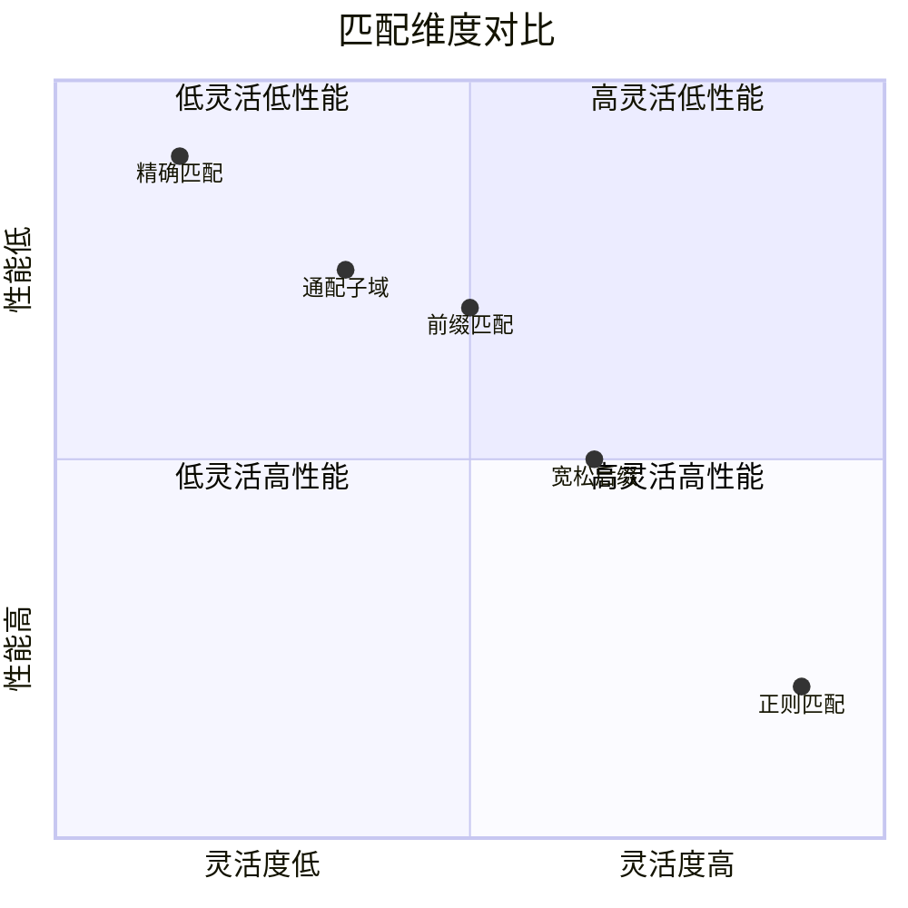
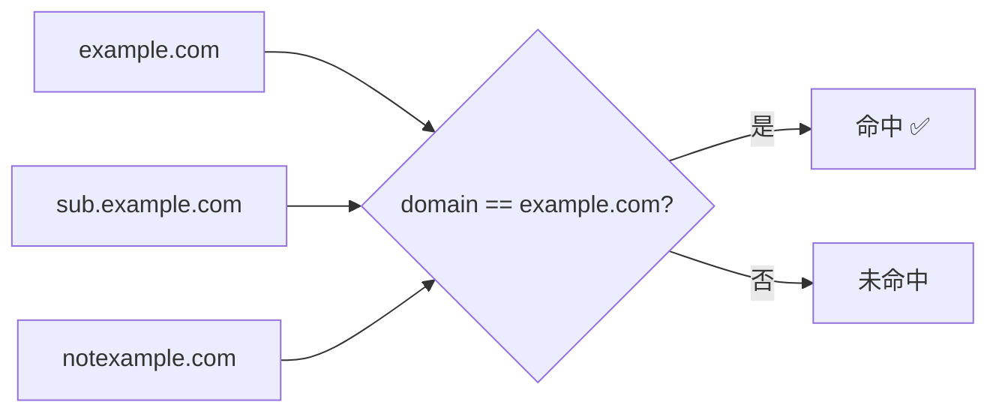
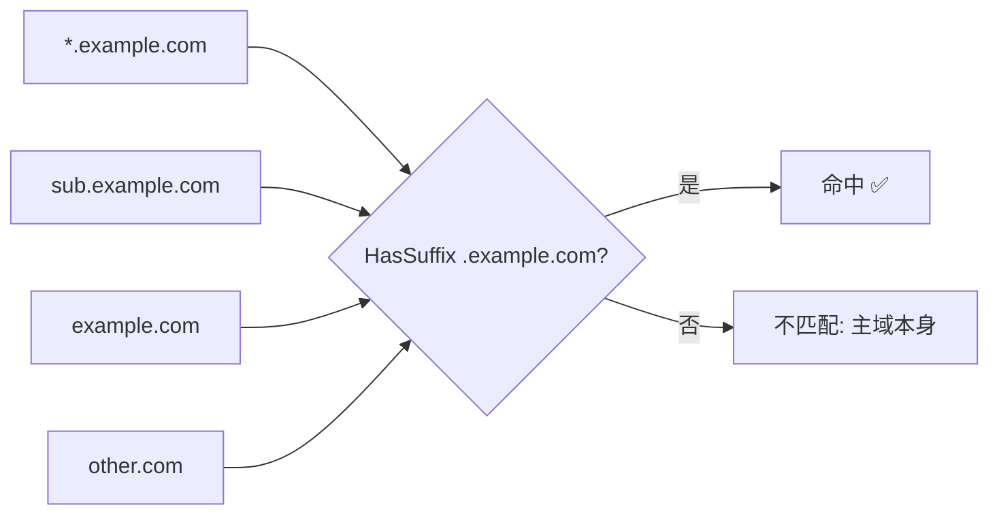
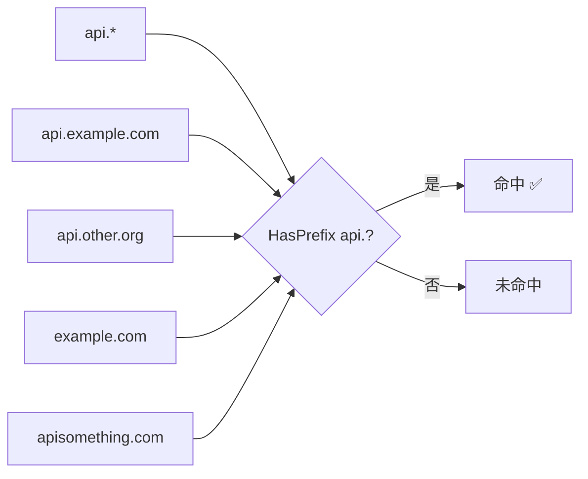
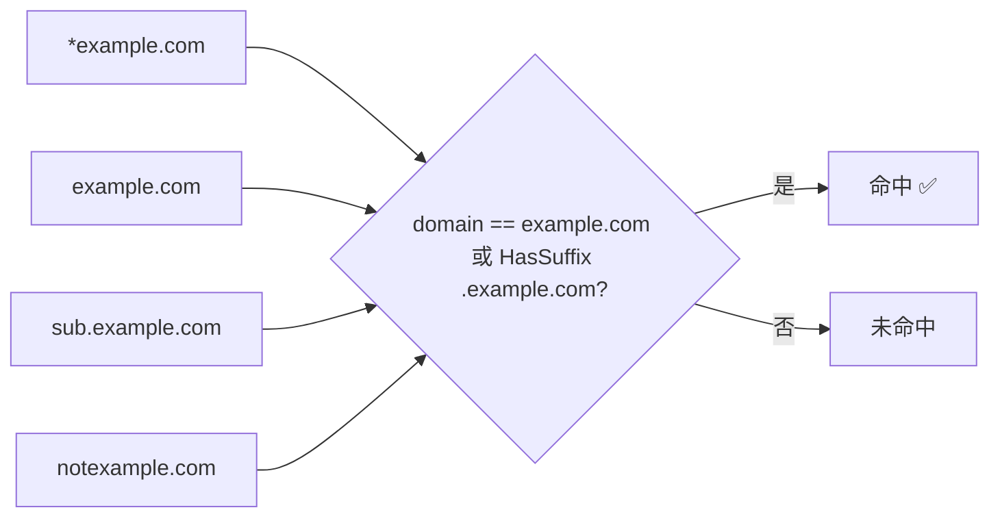
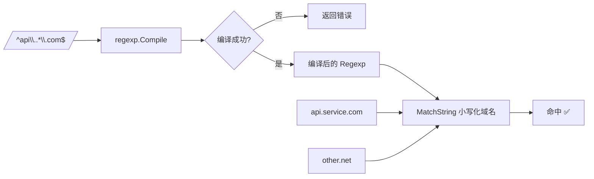
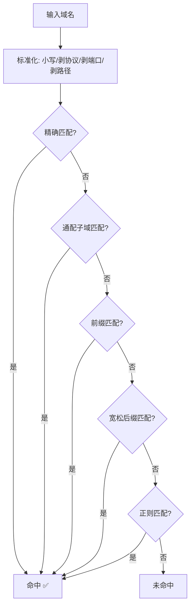
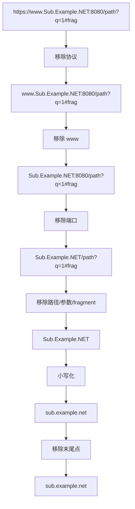

# 域名匹配维度的深入理解

## 五种匹配维度

DomainACL 支持五种不同的匹配维度，满足从简单到复杂的各种场景：



## 精确匹配



最简单的匹配方式，`includeSubdomains=false` 时使用 `map[string]struct{}` O(1) 查找：

```go
acl.Add("example.com")
// 匹配: example.com
// 不匹配: sub.example.com, notexample.com
```

## 通配子域 `*.example.com`



仅匹配子域名，**不包含主域本身**：

```go
acl.Add("*.example.com")
// 匹配: sub.example.com, deep.sub.example.com
// 不匹配: example.com（主域本身不匹配）
```

## 前缀匹配 `api.*`



匹配以指定前缀开头的域名——适合 API 域名分组：

```go
acl.Add("api.*")
// 匹配: api.example.com, api.service.com
// 不匹配: example.com, apiservice.com
```

## 宽松后缀 `*example.com`



匹配主域本身及其任意子域名，**使用标签边界**防止误匹配：

```go
acl.Add("*example.com")
// 匹配: example.com, sub.example.com, deep.sub.example.com
// 不匹配: notexample.com（标签边界保护！）
```

## 正则匹配 `/pattern/`



最灵活的方式，按声明顺序依次匹配（Go RE2 引擎，天然防 ReDoS）：

```go
acl.Add("/^api\\..*\\.com$/")
// 匹配: api.service.com
// 不匹配: api.service.net, plain.com
```

## 匹配优先级



匹配顺序固定：精确 → 通配子域 → 前缀 → 宽松后缀 → 正则。一旦命中立即返回，不继续检查后续维度。正则匹配按声明顺序检查，多个正则中第一个命中的生效。

## 域名标准化



标准化包含：
1. 移除协议前缀（`http://`、`https://`）
2. 移除 `www` 前缀
3. 移除端口号
4. 移除路径、查询参数和 fragment
5. 转换为小写（DNS 大小写不敏感）
6. 移除末尾点（FQDN 根标签）

## 性能对比

| 维度 | 复杂度 | 规则数 1000 时 | 说明 |
|------|--------|---------------|------|
| 精确匹配 | O(1) | ~70 ns/op | map 查找，常数级 |
| 通配子域 | O(n) | ~80 µs/op | 线性扫描后缀列表 |
| 前缀匹配 | O(n) | ~80 µs/op | 线性扫描前缀列表 |
| 宽松后缀 | O(n) | ~80 µs/op | 线性扫描后缀列表 |
| 正则匹配 | O(n) | ~100-500 µs/op | 线性扫描，取决于正则复杂度 |