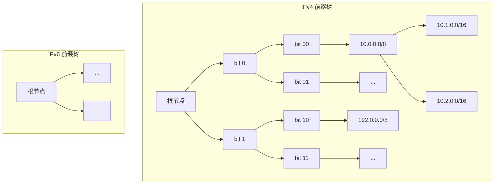
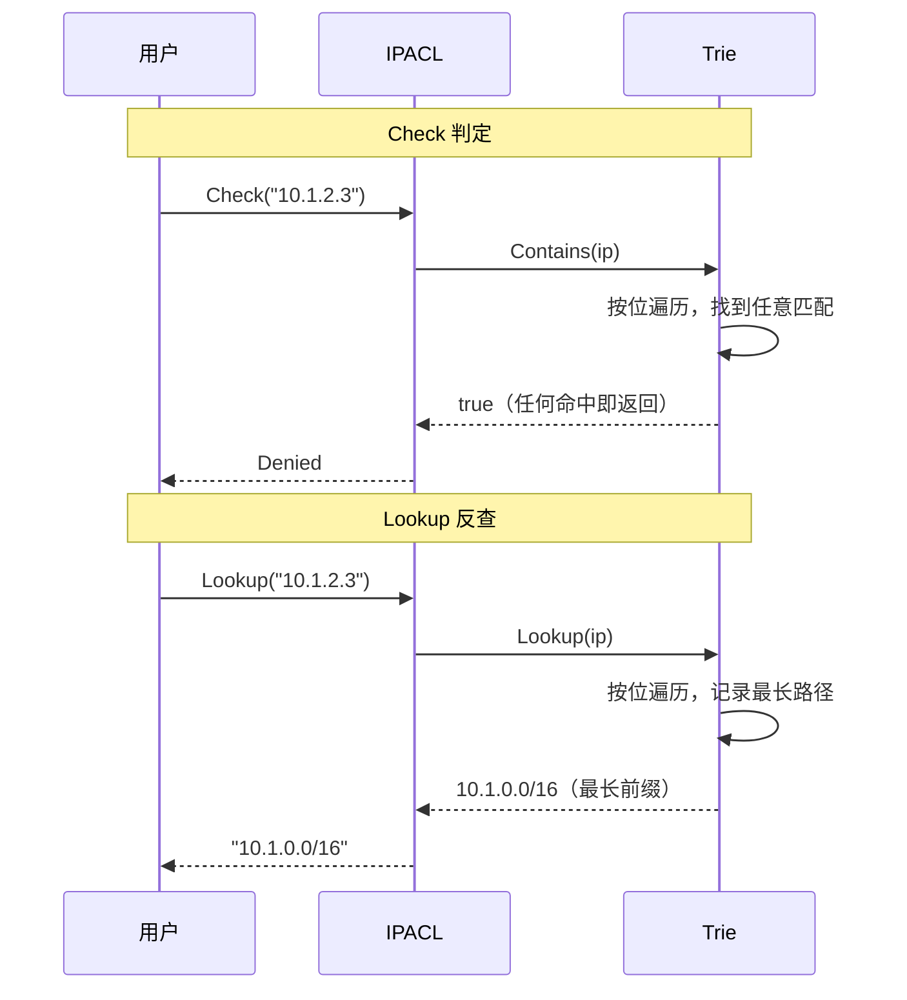
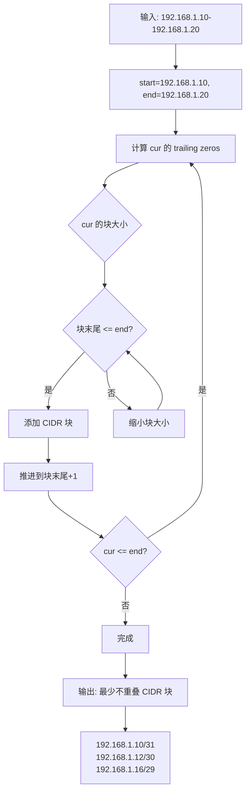
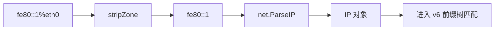
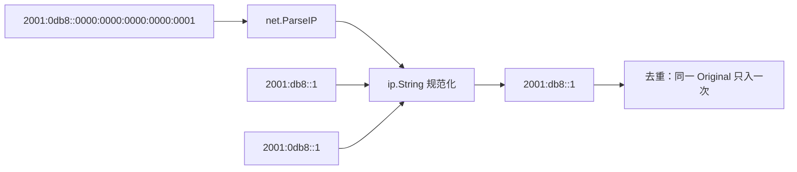
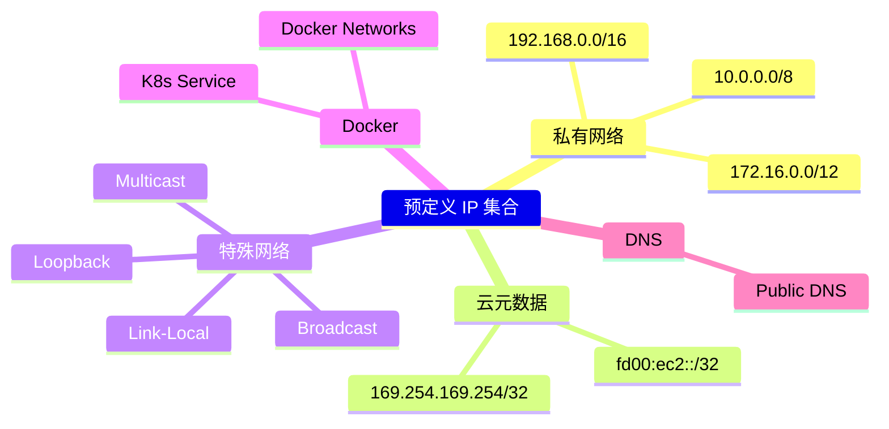
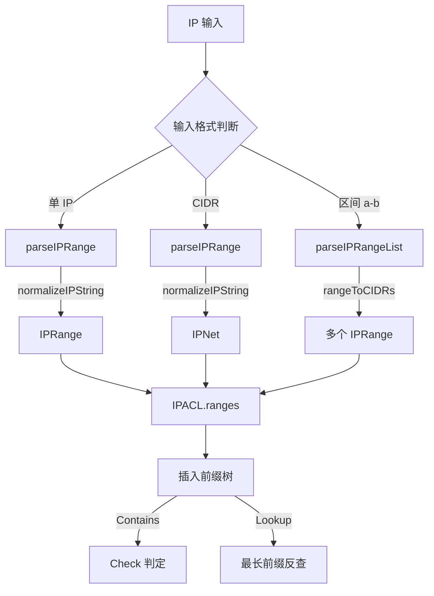

# IP 匹配深入理解

## 前缀树（Trie）匹配

IPACL 使用双前缀树（IPv4/IPv6 各一棵独立子树）实现 O(prefixLen) 匹配，与规则数无关：

## 匹配 vs 最长前缀 Lookup

## 区间展开算法

`a-b` 区间语法使用 `math/big` 进行 CIDR 展开，避免 IPv6 巨区间溢出：

## Zone ID 处理

IPv6 链路本地地址 (`fe80::1%eth0`) 中的 zone id 会在检查前自动剥离：

## 去重与规范化

## 预定义 IP 集合

## 完整数据流

