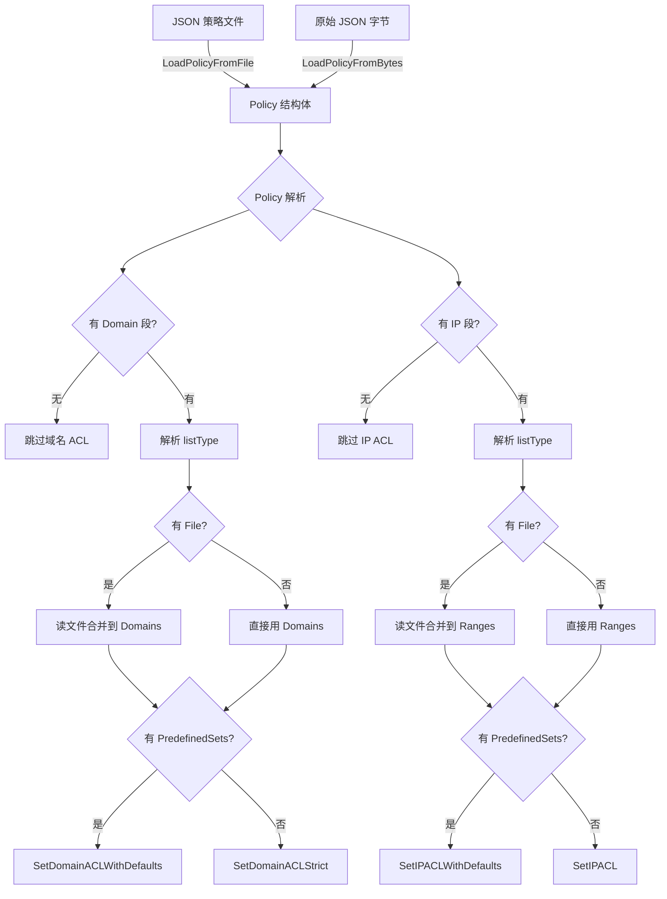
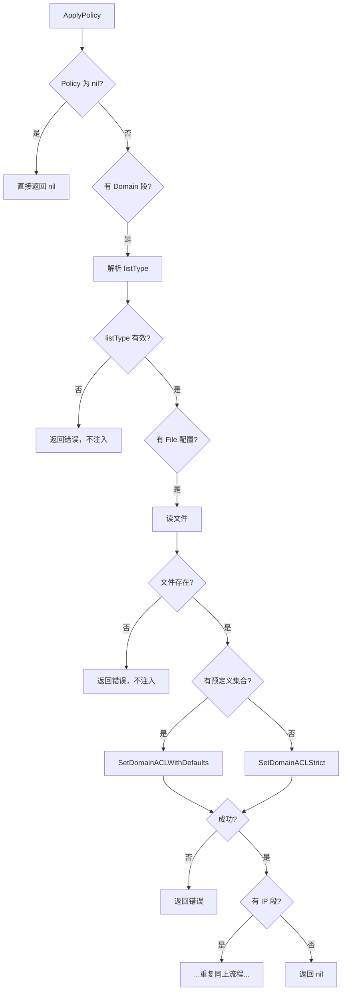

# JSON Policy 配置

## 策略文件结构

支持通过 JSON 文件定义完整的 ACL 策略，实现配置与代码分离：

```json
{
  "ip": {
    "ranges": ["10.0.0.0/8", "192.168.0.0/16"],
    "listType": "blacklist",
    "predefinedSets": ["PrivateNetworks", "CloudMetadata"],
    "allowPredefined": false,
    "file": "config/ip_blacklist.txt"
  },
  "domain": {
    "domains": ["evil.example.com", "*.malware.test"],
    "listType": "blacklist",
    "includeSubdomains": true,
    "predefinedSets": ["Shorteners", "DisposableEmail"],
    "allowPredefined": false,
    "file": "config/domain_blacklist.txt"
  }
}
```

## 应用策略

```go
package main

import (
    "fmt"
    "github.com/cyberspacesec/acl-skills/pkg/acl"
    "github.com/cyberspacesec/acl-skills/pkg/config"
)

func main() {
    m := acl.NewManager()

    // 从文件加载策略
    policy, err := config.LoadPolicyFromFile("security_policy.json")
    if err != nil {
        panic(err)
    }

    // 注入 Manager
    if err := m.ApplyPolicy(policy); err != nil {
        panic(err)
    }

    // 验证
    fmt.Println(m.CheckIP("10.0.0.1"))       // Denied
    fmt.Println(m.CheckDomain("bit.ly"))     // Denied（短链预定义集合）
}
```

## 策略处理流程



## 文件格式

辅助文件（被 Policy 的 `file` 字段引用）每行一条规则，支持注释：

```text
# 内网 IP 黑名单（行注释）
10.0.0.0/8
172.16.0.0/12
192.168.0.0/16

# 云元数据
169.254.169.254/32  # 行内注释

# IPv6
fd00::/8
```

## 完整示例：安全策略

```json
{
  "ip": {
    "ranges": ["10.0.0.0/8", "192.168.0.0/16"],
    "listType": "blacklist",
    "predefinedSets": [
      "PrivateNetworks",
      "CloudMetadata",
      "DockerNetworks",
      "K8sServiceAddresses"
    ],
    "allowPredefined": false
  },
  "domain": {
    "domains": ["evil.example.com", "*.malware.test"],
    "listType": "blacklist",
    "includeSubdomains": true,
    "predefinedSets": [
      "Shorteners",
      "DisposableEmail",
      "TorExitNodes",
      "AllMaliciousDomains"
    ],
    "allowPredefined": false
  }
}
```

## 错误处理



**失败语义**：任何子步骤出错都会在注入 Manager 之前返回，避免 Manager 被部分写入的半应用状态。