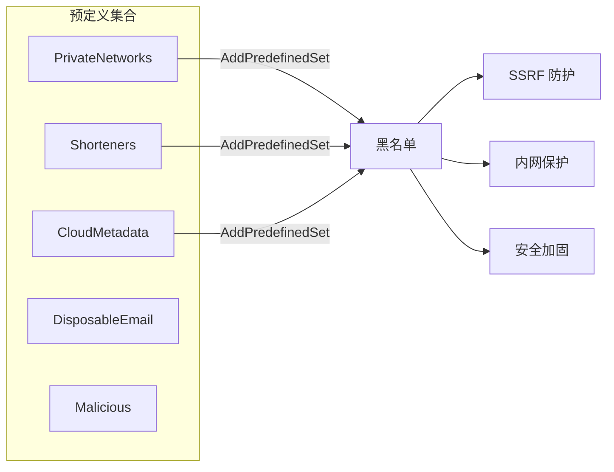
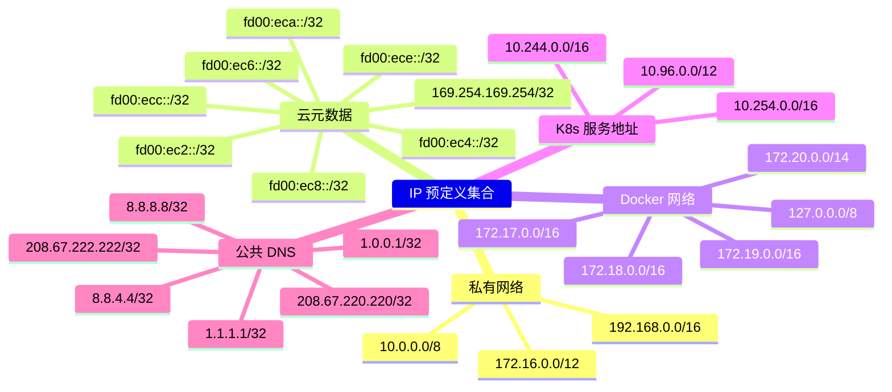
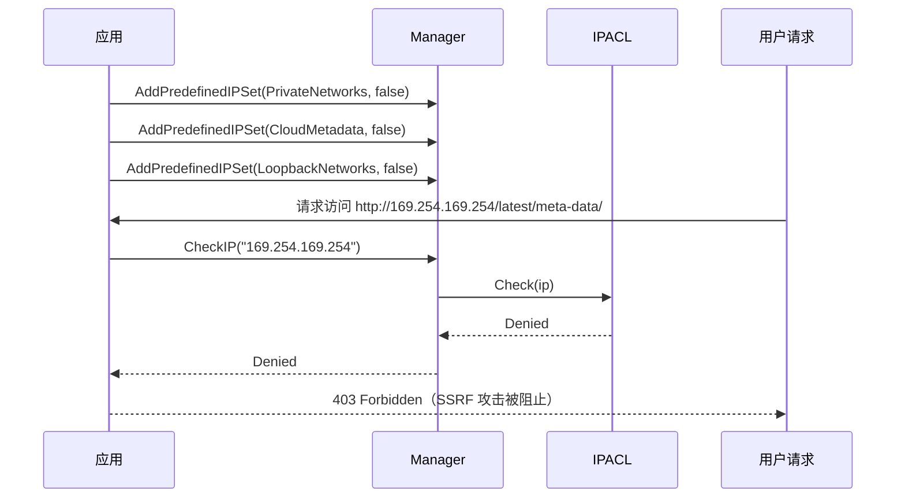
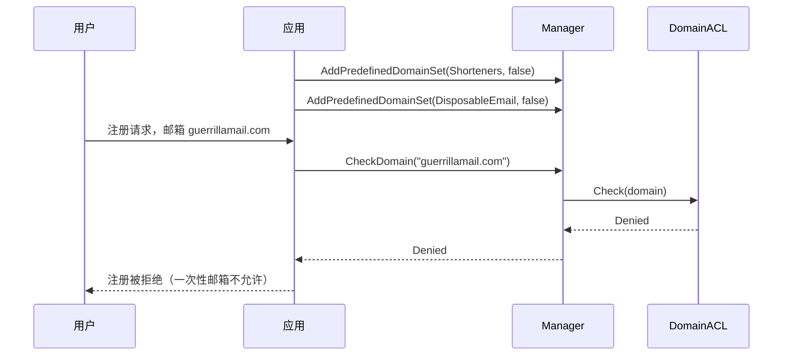
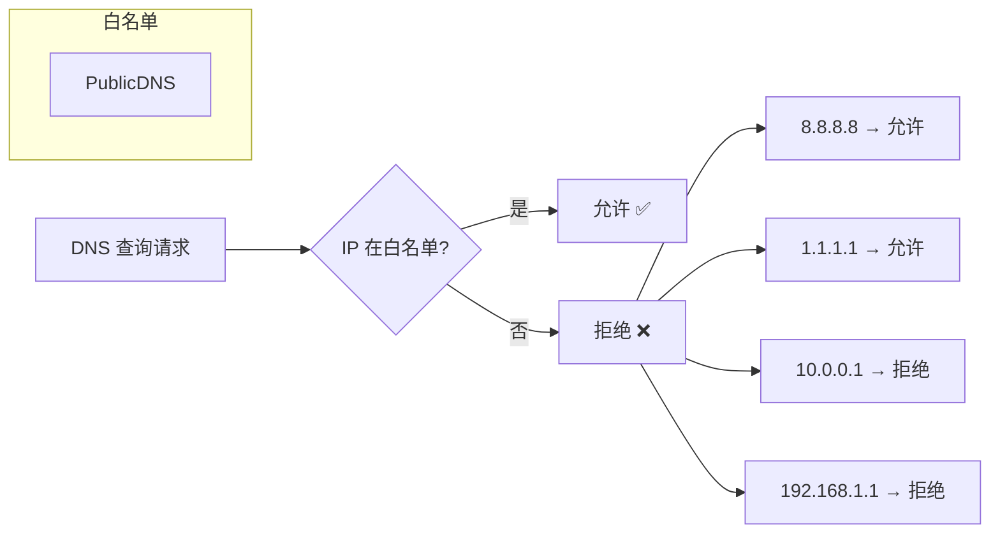

# 预定义集合

## 概述

预定义集合是内置的常见 IP 和域名范围，开箱即用，无需手动枚举：



## 域名预定义集合

```go
m.AddPredefinedDomainSet(domain.Shorteners, false)       // 阻止短链
m.AddPredefinedDomainSet(domain.DisposableEmail, false)  // 阻止一次性邮箱
m.AddPredefinedDomainSet(domain.AllMaliciousDomains, false) // 阻止所有恶意域名
```

### 完整清单

| 集合 | 常量 | 说明 | 典型用途 |
|------|------|------|---------|
| 短链 | `Shorteners` | bit.ly, t.co, tinyurl 等 | 防止 URL 重定向绕过 |
| 公开文件分享 | `PublicFileSharing` | dropbox, google drive 等 | 数据泄露防护 |
| 代码托管 | `CodeHosting` | github, gitlab, bitbucket 等 | 代码泄露防护 |
| 社交媒体 | `SocialMedia` | facebook, twitter, linkedin 等 | 访问控制 |
| 网页邮箱 | `WebmailProviders` | gmail, outlook, yahoo mail 等 | 数据泄露防护 |
| Tor 出口节点 | `TorExitNodes` | Tor 网络出口节点域名 | 匿名访问防护 |
| 一次性邮箱 | `DisposableEmail` | 10minutemail, guerrillamail 等 | 注册滥用防护 |
| 可信 CDN | `TrustedCDN` | cloudflare, akamai, fastly 等 | 白名单放行 |
| 全部恶意域名 | `AllMaliciousDomains` | 以上所有集合的并集 | 一站式安全加固 |

## IP 预定义集合

```go
m.AddPredefinedIPSet(ip.PrivateNetworks, false)     // 阻止私有网络
m.AddPredefinedIPSet(ip.CloudMetadata, false)        // 阻止云元数据
m.AddPredefinedIPSet(ip.AllSpecialNetworks, false)   // 阻止所有特殊网络
```

### 完整清单



## 使用场景：SSRF 防护



## 使用场景：黑名单短链



## 使用场景：白名单仅允许公共 DNS

