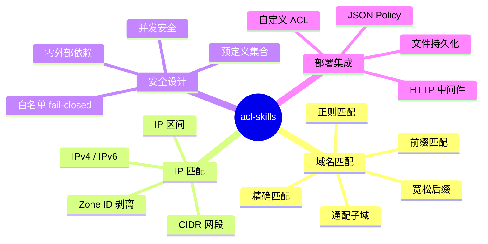
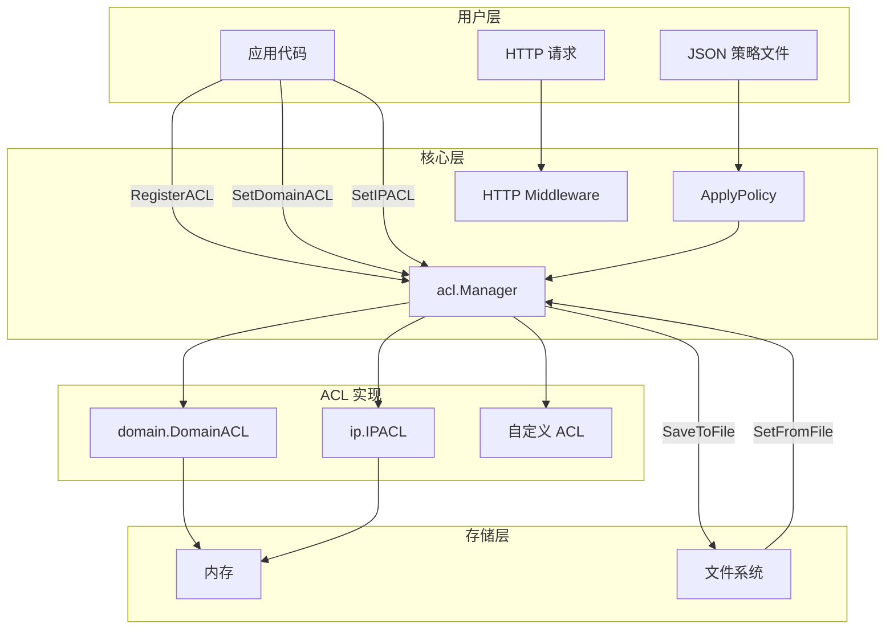

# 欢迎使用 acl-skills

**acl-skills** 是一个强大、高效、易用的 Go 访问控制列表（ACL）库，零外部依赖，专注于保护您的应用免受未授权访问。

## 为什么选择 acl-skills？



## 核心特性

| 特性 | 说明 |
|------|------|
| 🚀 **高性能** | IP 匹配基于前缀树（Trie），O(prefixLen) 与规则数无关；域名精确匹配 O(1) |
| 🔒 **安全优先** | 白名单模式 fail-closed，空值/空输入默认拒绝 |
| 🌐 **双维度** | 域名 5 种匹配维度 + IP 全语法（v4/v6/CIDR/区间） |
| 📦 **零依赖** | 纯 Go 标准库实现，无外部依赖，`go get` 即用 |
| 🧵 **并发安全** | 内置 `sync.RWMutex`，不同 ACL 类型互不阻塞 |
| ⚙️ **灵活集成** | HTTP 中间件、JSON Policy 配置、文件持久化、自定义 ACL 注册 |

## 架构概览



## 快速示例

```go
package main

import (
    "fmt"
    "github.com/cyberspacesec/acl-skills/pkg/acl"
    "github.com/cyberspacesec/acl-skills/pkg/types"
)

func main() {
    m := acl.NewManager()

    // 阻止内网 IP
    m.SetIPACL([]string{"10.0.0.0/8", "192.168.0.0/16"}, types.Blacklist)
    // 阻止恶意域名
    m.SetDomainACL([]string{"evil.example.com", "*.malware.test"}, types.Blacklist, true)

    // 检查
    fmt.Println(m.CheckIP("10.0.0.1"))    // Denied
    fmt.Println(m.CheckIP("8.8.8.8"))      // Allowed
    fmt.Println(m.CheckDomain("evil.example.com")) // Denied
}
```

## 下一步

- [快速开始：安装](quickstart/installation.md) — 安装与导入
- [核心架构](architecture.md) — 深入了解设计
- [GitHub 仓库](https://github.com/cyberspacesec/acl-skills) — 源码与 issues