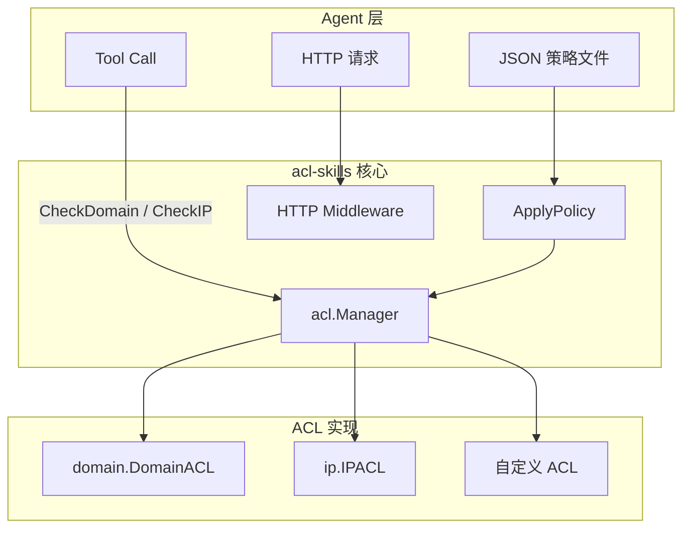

# 欢迎使用 acl-skills

**acl-skills** 是一个为 AI Agent 设计的 Go 访问控制列表（ACL）库，零外部依赖，提供域名与 IP 双维度访问控制，保护 Agent 的出向请求免受 SSRF 攻击和未授权访问。

## 为什么 Agent 需要 ACL？

AI Agent 在执行工具调用（tool use）时会发起 HTTP 请求。若没有访问控制，攻击者可通过 Prompt Injection 将 Agent 引导访问内部服务、云元数据端点或数据外泄目标。

| 风险 | 无 ACL | 有 acl-skills |
|------|--------|--------------|
| SSRF（用户提供 URL） | Agent 访问内网服务 | 请求发出前即被拦截 |
| 数据外泄 | Agent POST 到攻击者服务器 | 域名黑名单命中拦截 |
| 云凭证窃取 | Agent 访问 `169.254.169.254` | CloudMetadata 预设集阻断 |
| 工具滥用 | 无法限制 Agent 可调用的目标 | 按 kind 独立 ACL 管控 |

## 快速接入（SSRF 防护）

```go
import (
    "github.com/cyberspacesec/acl-skills/pkg/acl"
    "github.com/cyberspacesec/acl-skills/pkg/ip"
    "github.com/cyberspacesec/acl-skills/pkg/types"
)

manager := acl.NewManager()

// 一行阻断所有 Agent 不应访问的地址
manager.SetIPACLWithDefaults(nil, types.Blacklist, []ip.PredefinedSet{
    ip.PrivateNetworks,   // 10.x、192.168.x、172.16.x
    ip.LoopbackNetworks,  // 127.x、::1
    ip.CloudMetadata,     // 169.254.169.254
    ip.DockerNetworks,    // 172.17.x
}, false)

// 在 Agent 的 HTTP dial 钩子中检查
func agentDial(network, addr string) (net.Conn, error) {
    host, _, _ := net.SplitHostPort(addr)
    if perm, _ := manager.CheckIP(host); perm == types.Denied {
        return nil, fmt.Errorf("acl: blocked %s", host)
    }
    return net.Dial(network, addr)
}
```

## 架构概览



## 核心特性

| 特性 | 说明 |
|------|------|
| 🛡️ **SSRF 防护** | 内置私有网络、云元数据、回环地址等预定义黑名单集合 |
| 🚀 **高性能** | IP 前缀树 O(prefixLen) 常数级，域名精确匹配 O(1)，零内存分配 |
| 🌐 **双维度** | 域名（精确/子域/前缀/后缀/正则）+ IP（CIDR/区间/IPv6） |
| 📦 **fa️** | 纯 Go 标准库实，`go get` 即用 |
| +𧧵 **并发安全** | 内置 `sync.RWMutex`，不同 ACL kind 互不阻塞 |
| ⚙️ **灵活集成** | HTTP 中间件、JSON Policy数据配置、斄建挄簏、三个实现选展 |

## 下一步

- [安装](quickstart/installation.md) — 一行安装，零外部依赖
- [域名 ACL](quickstart/domain-acl.md) — 为 Agent 配置域名白/黑名单
- [IP ACL](quickstart/ip-acl.md) — SSRF 防护与预定义集合
- [HTTP 中间件](quickstart/middleware.md) — 一行接入 Agent 服务
- [核心架构](architecture.md) — 深入了解设计
