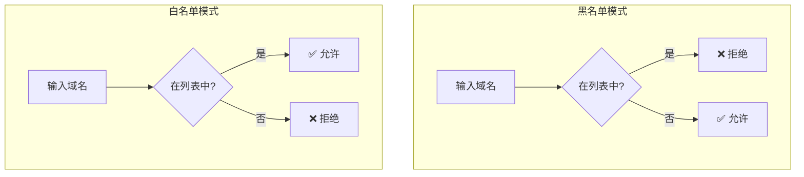
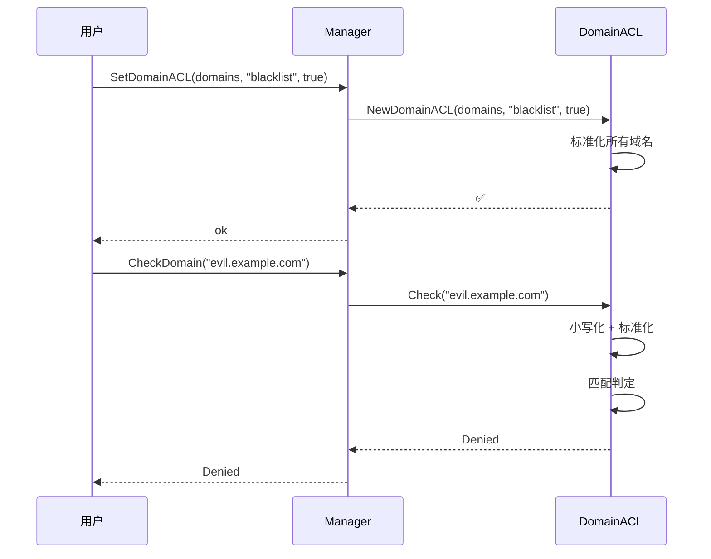

# 域名 ACL 快速开始

## 基本用法

```go
package main

import (
    "fmt"
    "github.com/cyberspacesec/acl-skills/pkg/acl"
    "github.com/cyberspacesec/acl-skills/pkg/types"
)

func main() {
    m := acl.NewManager()

    // 黑名单：阻止恶意域名
    m.SetDomainACL([]string{
        "evil.example.com",
        "spam.org",
        "*.malware.test",
    }, types.Blacklist, true)

    // 检查
    tests := []string{
        "evil.example.com",
        "sub.malware.test",
        "safe.example.com",
    }
    for _, d := range tests {
        perm, _ := m.CheckDomain(d)
        fmt.Printf("%-20s → %s\n", d, perm)
    }
}
```

## 黑名单 vs 白名单



## 包含子域名

`includeSubdomains` 参数控制子域名匹配行为：

```go
// includeSubdomains = true：精确匹配 + 子域名
m.SetDomainACL([]string{"example.com"}, types.Blacklist, true)
// 匹配: example.com, sub.example.com, deep.sub.example.com
// 不匹配: notexample.com, evil.com

// includeSubdomains = false：仅精确匹配
m.SetDomainACL([]string{"example.com"}, types.Blacklist, false)
// 仅匹配: example.com
// 不匹配: sub.example.com
```

## 使用 Strict 模式

`SetDomainACLStrict` 返回无效域名错误，与 IP ACL 的错误语义对称：

```go
err := m.SetDomainACLStrict([]string{
    "valid.example.com",
    "bad..domain",   // 无效域名，会报错
}, types.Blacklist, true)
if err != nil {
    fmt.Printf("域名 ACL 设置失败: %v\n", err)
}
```

## 完整流程

