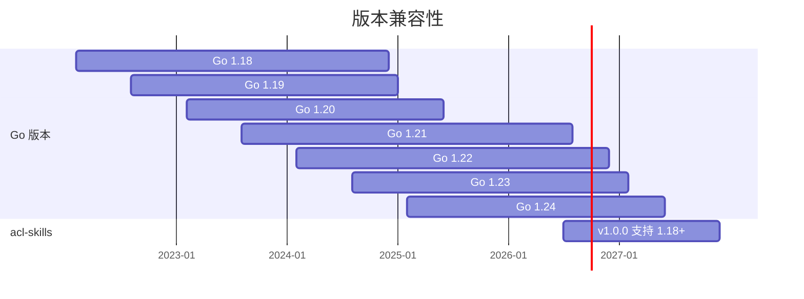

# 安装

## 前置条件

- Go 1.18 或更高版本
- 无需外部依赖，仅使用 Go 标准库

## 安装

```bash
go get github.com/cyberspacesec/acl-skills
```

导入：

```go
import (
    "github.com/cyberspacesec/acl-skills/pkg/acl"
    "github.com/cyberspacesec/acl-skills/pkg/types"
    "github.com/cyberspacesec/acl-skills/pkg/domain"
    "github.com/cyberspacesec/acl-skills/pkg/ip"
    "github.com/cyberspacesec/acl-skills/pkg/middleware"
    "github.com/cyberspacesec/acl-skills/pkg/config"
)
```

## 验证安装

```go
package main

import (
    "fmt"
    "github.com/cyberspacesec/acl-skills/pkg/ip"
    "github.com/cyberspacesec/acl-skills/pkg/types"
)

func main() {
    acl, err := ip.NewIPACL([]string{"10.0.0.0/8"}, types.Blacklist)
    if err != nil {
        panic(err)
    }
    perm, _ := acl.Check("10.0.0.1")
    fmt.Println(perm) // Denied
}
```

## 最小 Go 版本

