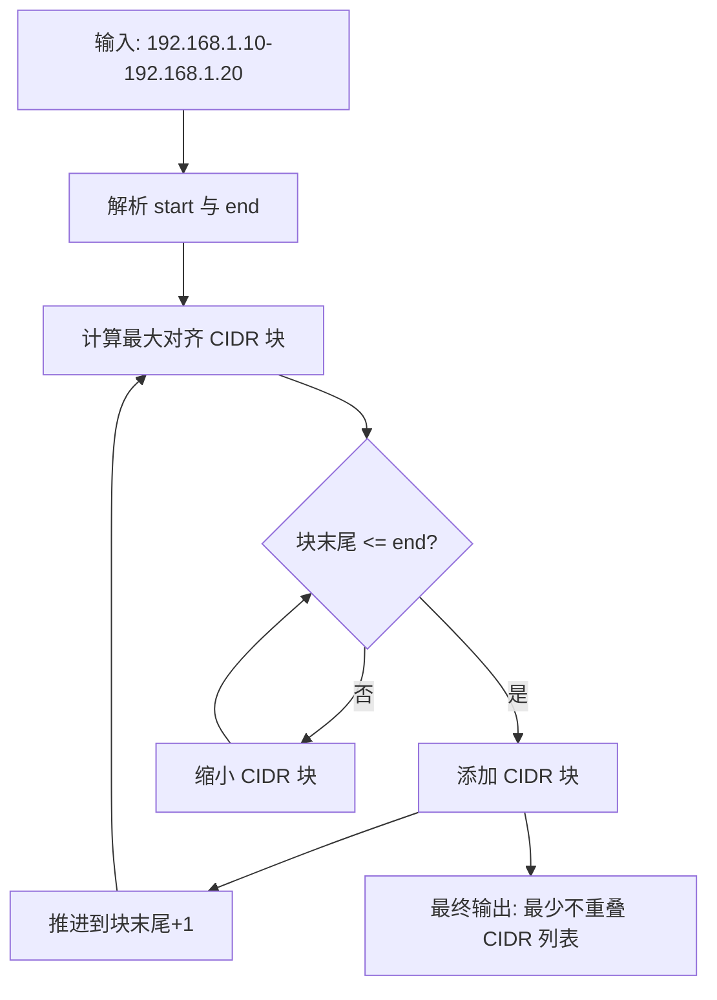
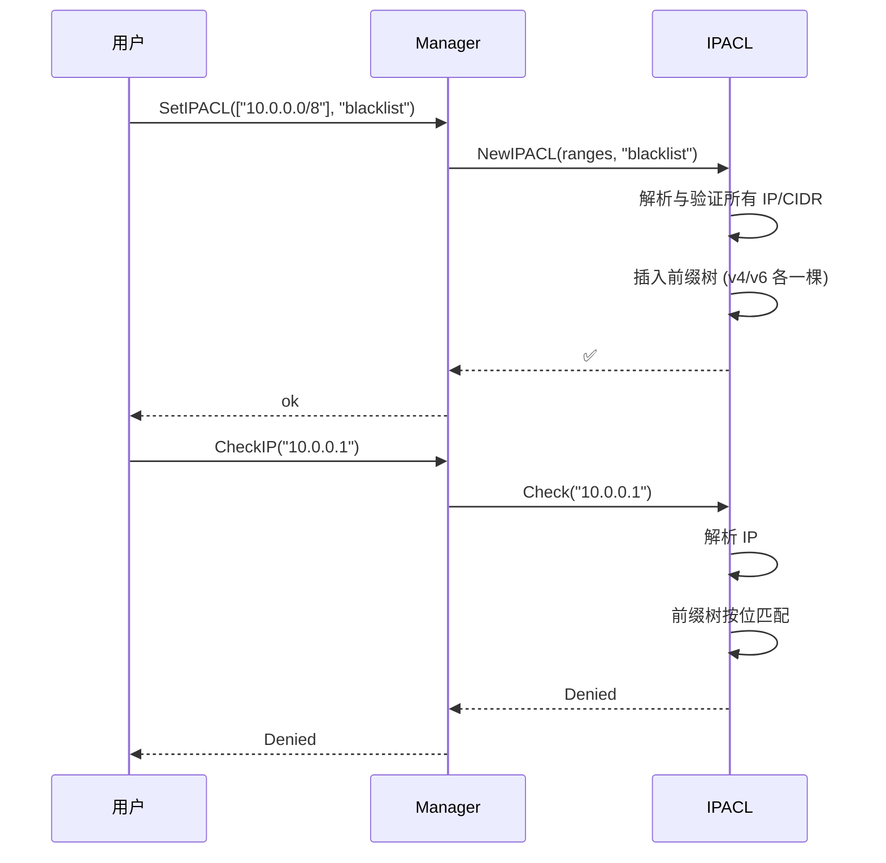

# IP ACL 快速开始

## 基本用法

```go
package main

import (
    "fmt"
    "github.com/cyberspacesec/acl-skills/pkg/acl"
    "github.com/cyberspacesec/acl-skills/pkg/types"
)

func main() {
    m := acl.NewManager()

    // 黑名单：阻止内网和云元数据地址
    m.SetIPACL([]string{
        "10.0.0.0/8",
        "172.16.0.0/12",
        "192.168.0.0/16",
        "169.254.169.254/32", // 云元数据
    }, types.Blacklist)

    // 检查
    tests := []string{
        "10.0.0.1",
        "192.168.1.100",
        "8.8.8.8",
        "1.1.1.1",
    }
    for _, ip := range tests {
        perm, _ := m.CheckIP(ip)
        fmt.Printf("%-16s → %s\n", ip, perm)
    }
}
```

## IP 语法

acl-skills 支持多种 IP 输入语法：

```mermaid
flowchart LR
    A[IP 输入] --> B{输入格式}

    B -->|单 IP| C[192.168.1.1]
    B -->|CIDR| D[10.0.0.0/8]
    B -->|区间| E[192.168.1.1-192.168.1.255]
    B -->|Zone ID| F[fe80::1%eth0]

    C --> G[/32 或 /128 掩码]
    D --> H[按前缀展开]
    E --> I[math/big 展开为最少 CIDR]
    F --> J[自动剥离 %eth0]
```

## 各语法示例

| 语法 | 示例 | 说明 |
|------|------|------|
| 单 IP | `192.168.1.1` | 单个 IPv4 或 IPv6 地址 |
| CIDR | `10.0.0.0/8` | 标准 CIDR 网段 |
| 区间 | `192.168.1.1-192.168.1.100` | 闭区间，自动展开为最少 CIDR 块 |
| Zone ID | `fe80::1%eth0` | IPv6 链路本地地址，自动剥离 zone |

## 区间语法原理

区间语法 `a-b` 使用 `math/big` 进行 CIDR 展开，彻底避免 IPv6 巨区间下的整数溢出：



## 最长前缀反查 Lookup

```go
acl, _ := ip.NewIPACL([]string{
    "10.0.0.0/8",
    "10.1.0.0/16",
}, types.Blacklist)

cidr, _ := acl.Lookup("10.1.2.3")
fmt.Println(cidr) // "10.1.0.0/16"（最长前缀匹配）

cidr, _ = acl.Lookup("192.168.0.1")
fmt.Println(cidr) // ""（无匹配）
```

## 完整流程

