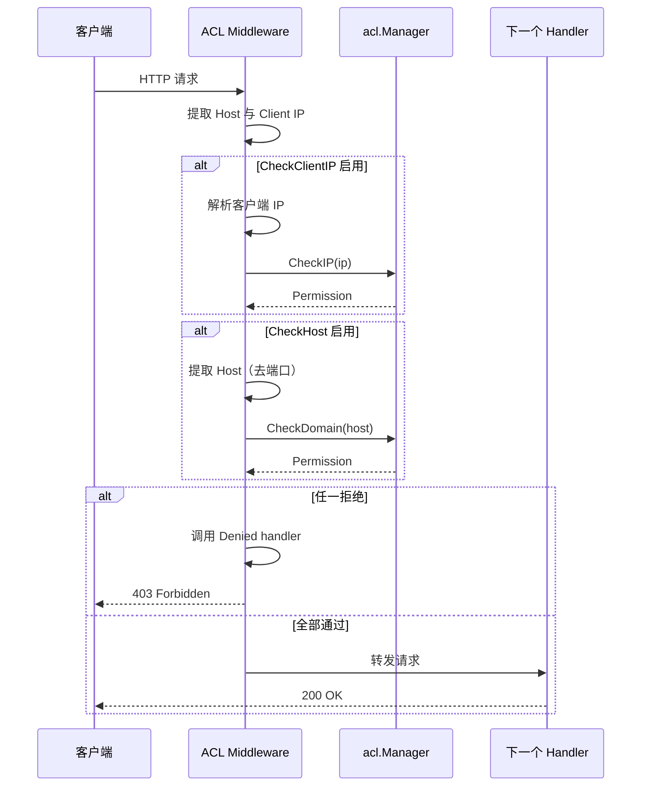
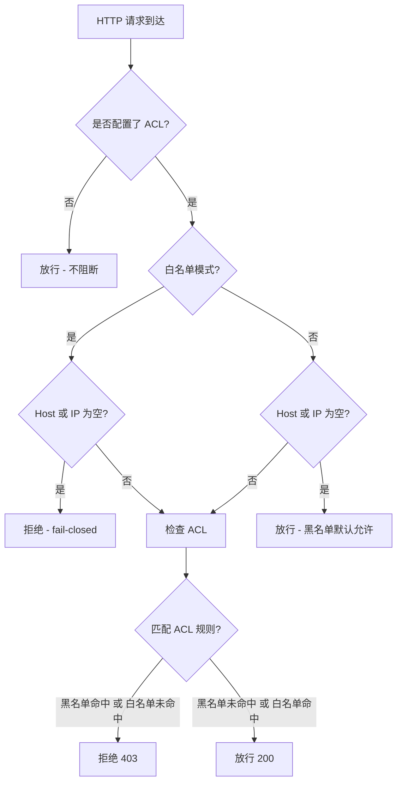

# HTTP 中间件

## 快速集成

将 ACL 检查集成到现有 HTTP 服务：

```go
package main

import (
    "net/http"
    "github.com/cyberspacesec/acl-skills/pkg/acl"
    "github.com/cyberspacesec/acl-skills/pkg/middleware"
    "github.com/cyberspacesec/acl-skills/pkg/types"
)

func main() {
    m := acl.NewManager()
    m.SetIPACL([]string{"10.0.0.0/8"}, types.Blacklist)
    m.SetDomainACL([]string{"evil.example.com"}, types.Blacklist, true)

    opts := middleware.Options{
        TrustProxy:    false, // 默认：不信任代理头
        CheckClientIP: true,  // 检查客户端 IP
        CheckHost:     true,  // 检查 Host 头
    }

    handler := middleware.New(m, opts)(http.HandlerFunc(func(w http.ResponseWriter, r *http.Request) {
        w.Write([]byte("Hello, authenticated user!"))
    }))

    http.ListenAndServe(":8080", handler)
}
```

## 中间件处理流程



## Options 配置

| 字段 | 类型 | 默认值 | 说明 |
|------|------|--------|------|
| `TrustProxy` | `bool` | `false` | 为 true 时信任 `X-Real-IP` / `X-Forwarded-For`，否则仅用 `RemoteAddr` |
| `CheckClientIP` | `bool` | `true` | 是否检查客户端 IP 是否被 ACL 拒绝 |
| `CheckHost` | `bool` | `true` | 是否检查 Host 头域名是否被 ACL 拒绝 |
| `Denied` | `http.HandlerFunc` | 403 | 自定义拒绝响应 |

## 安全语义



## 代理头信任

当服务部署在反向代理（Nginx、Cloudflare）后时，需启用 `TrustProxy`：

```mermaid
flowchart LR
    Client -->|请求| LB[反向代理]
    LB -->|X-Real-IP: 8.8.8.8| App[应用服务器]

    subgraph TrustProxy = false
        A1[RemoteAddr = LB 的内网 IP]
    end

    subgraph TrustProxy = true
        A2[优先 X-Real-IP]
        A3[其次 X-Forwarded-For 首个]
        A4[兜底 RemoteAddr]
    end

    App --> A1
    App --> A2
    App --> A3
    App --> A4
```